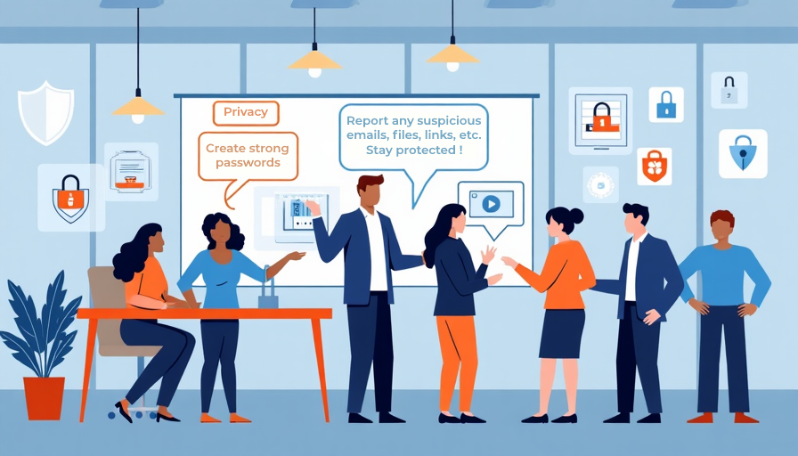

# Creating a Strong Security Culture at Innovatech Solutions

## Importance of a Security Culture

### Shared Responsibility in Cybersecurity

At Innovatech Solutions, cybersecurity is a shared responsibility. One of the most effective ways to protect against threats like phishing scams and fraudulent communications is by fostering a security culture throughout the company. This means making cybersecurity part of daily conversations and integrating it into the company's quarterly objectives.

---

## Key Elements of a Strong Security Culture

- **Ongoing Education:** Building a strong security culture starts with continuous education. Employees should be informed about evolving cyber threats, such as phishing emails and text-based scams, and be equipped with the knowledge to recognize and report suspicious activity.
- **Strategic Integration:** It’s crucial to make cybersecurity a core part of Innovatech’s strategic goals, ensuring that security measures are regularly reviewed, updated, and prioritized.

---

## Integrating Cybersecurity into Company Objectives

import ImageSliderWrapper from '../components/ImageSliderWrapper'

<ImageSliderWrapper 
  className="flex min-h-screen flex-col items-center justify-center"
  selectedSet="culture"
/>

---

- **Highlighting Achievements:** Including cybersecurity in the company’s objectives signals its importance to every employee. Quarterly meetings should emphasize security achievements, identify areas for improvement, and set new goals to strengthen defenses.
- **Empowering Employees:** From enforcing strong password policies to promoting multi-factor authentication and regular data backups, these conversations empower employees to take ownership of security.

---

## Conclusion

By keeping cybersecurity at the forefront of daily operations, Innovatech Solutions ensures that all employees play an active role in protecting the company from potential cyber threats, creating a safer digital environment for everyone.
