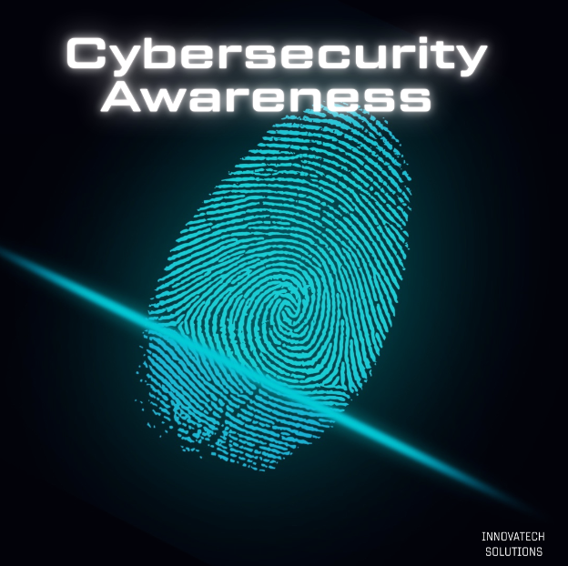

# Email Templates for Cybersecurity Awareness Campaign

## Pre-Launch Teaser Email

**Subject:** Coming Soon: Your Resource for Cybersecurity Awareness!

**Body:**
Dear [Employee Name],

Get ready! Innovatech Solutions is about to launch a new initiative to boost our cybersecurity defenses, and you play a crucial role.

**Coming Soon:** Our Cybersecurity Awareness Website.

Stay tuned for more details!

Best Regards,  
Jose Alicea-Cruz  
Marketing and Outreach Coordinator

---

## Launch Announcement Email

**Subject:** Launching Today: Innovatech's Cybersecurity Awareness Website!

**Body:**
Dear [Employee Name],

We are excited to announce the launch of our new Cybersecurity Awareness Website!  
Explore it now: [https://cybersecurity-awareness.vercel.app/](https://cybersecurity-awareness.vercel.app/)

**What You'll Find:**
- **Interactive Content:** Engage with videos, infographics, and quizzes.
- **Stay Informed:** Learn how to protect yourself and our company from cyber threats.
- **Contribute:** Help us build a stronger security culture.

**Featured Topics:**
- Using Multi-Factor Authentication
- Phishing
- Password Security
- Data Protection

**Visit the Website Now »**

Let's work together to safeguard our digital environment.

Best Regards,  
Jose Alicea-Cruz  
Marketing and Outreach Coordinator

---

## Follow-Up Email

**Subject:** Have You Explored Our Cybersecurity Resources Yet?

**Body:**
Dear [Employee Name],

Last week, we launched our Cybersecurity Awareness Website, and we've received great feedback so far!

**Highlights:**
- **Latest Insights:** Learn about protecting networks and the importance of regular data backups.

**Don't Miss Out! Visit the Website Today.**  
Access the Cybersecurity Resources » [https://cybersecurity-awareness.vercel.app/](https://cybersecurity-awareness.vercel.app/)

Your participation makes a difference.

Best Regards,  
Jose Alicea-Cruz  
Marketing and Outreach Coordinator