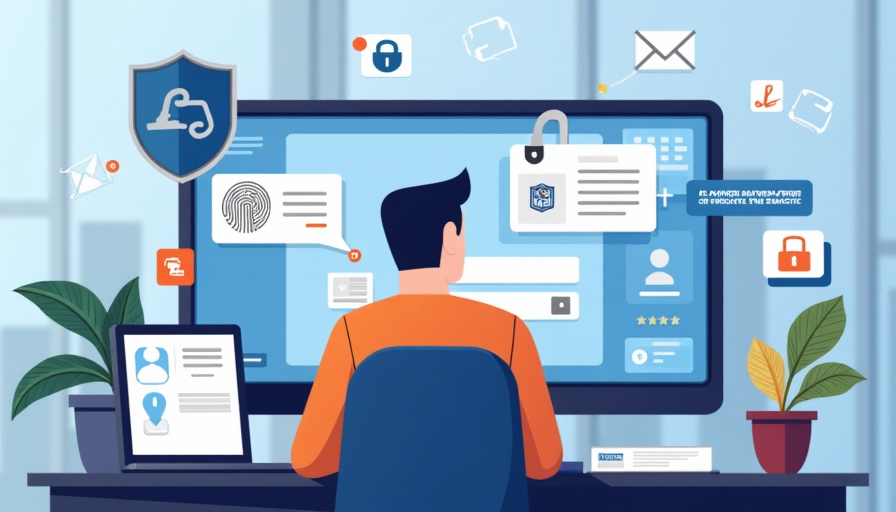

# Multi-Factor Authentication (MFA)

## Understanding Multi-Factor Authentication (MFA)

### What is Multi-Factor Authentication (MFA)?

Multi-Factor Authentication (MFA) is a security process that requires two or more verification methods to gain access to an account or system. MFA adds an extra layer of security on top of typical password verification. Some layers include text or email code verification, pre-established security questions, or biometrics like fingerprints.

---

### Why Is MFA Important?

MFA significantly reduces the risk of unauthorized access to your accounts. Even if a password is compromised, the additional authentication factors can prevent cybercriminals from gaining entry. According to studies, MFA is highly effective at preventing unauthorized access.

---

## How MFA Works

MFA typically involves three categories of authentication factors:

- **Knowledge Factors:** Something you know (e.g., password, PIN).
- **Possession Factors:** Something you have (e.g., smartphone).
- **Inherence Factors:** Something you are (e.g., fingerprint, facial recognition).

---

## Installing Multi-Factor Authentication

import ImageSliderMfa from '../components/imageslidermfa';

<ImageSliderMfa 
  className="flex min-h-screen flex-col items-center justify-center"
/>

---

## Types of Multi-Factor Authentication

- **SMS or Email Codes:** A one-time code is sent to your phone or email that you must enter after your password.
- **Pre-established Security Questions:** For example, "What was the name of your first pet?"
- **Biometric Authentication:** Uses fingerprints, facial recognition, or iris scans as a verification method.

---

## Best Practices for Using MFA

- **Enable MFA Everywhere:** Activate it on all accounts that support it.
- **Use Strong Methods:** Prefer authentication apps over SMS for added security.
- **Secure Your Devices:** Protect devices with strong passwords or biometric locks.
- **Backup Codes:** Store backup codes in a safe place for emergencies.
- **Beware of Phishing:** Always verify sources before entering authentication codes.

---

## Recognizing MFA Phishing Attempts

Be cautious of messages or emails that:

- Request your MFA codes directly.
- Urge you to disable MFA or bypass security measures.
- Contain links that lead to fraudulent websites asking for authentication information.

---

## What to Do If You Encounter Issues

- **Email Support@Innovatech.com:** If you have trouble with MFA, reach out to our IT support team for assistance.
- **Document the Issue:** Take notes on any error messages or unusual behavior to help IT resolve the problem.
- **Do Not Share Codes:** Never share your MFA codes with anyone, even if they claim to be from IT or another legitimate source.

---

## Conclusion

Implementing Multi-Factor Authentication is a crucial step in protecting your accounts and sensitive information at Innovatech Solutions. By following the best practices outlined in this module, you can enhance your security posture and help prevent unauthorized access.
