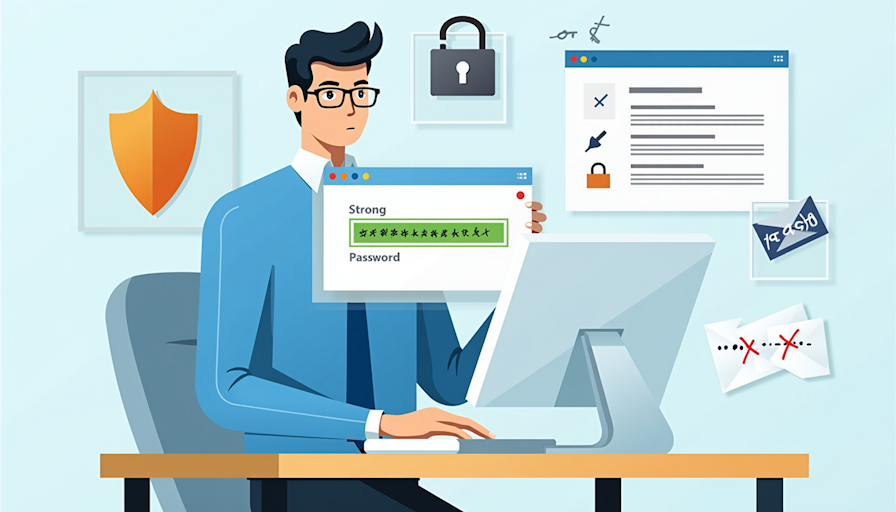

# Password Security

## Password Security Best Practices

### What is Password Security?

Password security involves creating and managing passwords to protect your personal and company accounts from unauthorized access. Strong passwords are your first line of defense against cyber threats.

### Why Is Password Security Important?

Weak or compromised passwords are a major cause of data breaches. Ensuring that your passwords are strong and secure is essential for protecting sensitive information at Innovatech Solutions.

---

## Characteristics of a Strong Password

A strong password should have the following characteristics:

- **Length:** At least 12-16 characters long.
- **Complexity:** Include a mix of uppercase and lowercase letters, numbers, and special characters (e.g., !, @, #).
- **Unpredictability:** Avoid common words, phrases, or easily guessed information like birthdays or names.

---

## Password Management Tips

- **Use Unique Passwords:** Never reuse passwords across multiple accounts. Each account should have its own unique password.
- **Utilize a Password Manager:** Consider using a reputable password manager to generate and store your passwords securely.
- **Enable Multi-Factor Authentication (MFA):** Add an extra layer of security by requiring a second form of verification (e.g., a code sent to your phone) in addition to your password.
- **Change Passwords Regularly:** Update your passwords every 3-6 months, or immediately if you suspect a breach.
- **Be Cautious with Security Questions:** Choose security questions that are not easily guessable and avoid using information that may be publicly available.

---

## Common Password Mistakes

- **Using Simple Passwords:** Avoid common passwords like "123456," "password," or variations of your name.
- **Storing Passwords in Plain Text:** Never write passwords down on sticky notes or in documents that are easily accessible.
- **Ignoring Updates:** If a service prompts you to change your password, do it promptly to maintain security.

---

## Recognizing Phishing Attempts Related to Passwords

Be cautious of emails or messages that:
- Request your password or sensitive information.
- Create a sense of urgency to change your password immediately.
- Contain links directing you to a login page that looks suspicious.

---

## Password Creation Exercise

Create a strong password using the following criteria:

- At least 15 characters long.
- Includes uppercase letters, lowercase letters, numbers, and special characters.
- Use a passphrase; for example: `"MyFriendAndHisDogEatBrusselSprouts"`.
- Does not contain any identifying information such as your name, family members' names, or your birthday.

---

## Data Breaches

Check your email address on sites such as **Leakpeek.com**. Leakpeek.com is a website that contains information exposed in data breaches. Users can check their passwords against exposed login records and see what accounts of theirs have been compromised. It will show the site, the username, and email address as well as a semi-redacted password. 

With a paid account, users can check an email address and access their unredacted password without the owner's email address being notified. Many people use the same password or variations of a password across multiple accounts. This gives threat actors access to your password.

---

## Conclusion

Password security is critical in protecting both personal and organizational data. By following the best practices outlined in this module, you can significantly reduce the risk of unauthorized access to your accounts.
