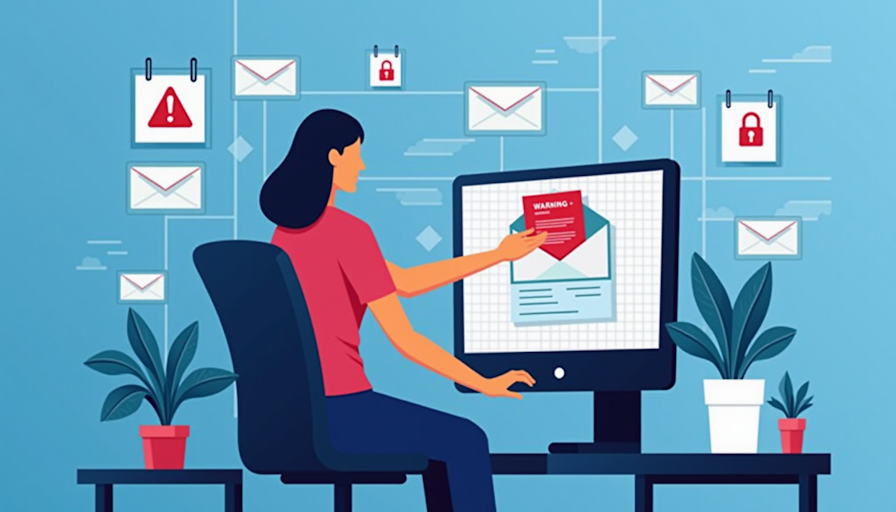
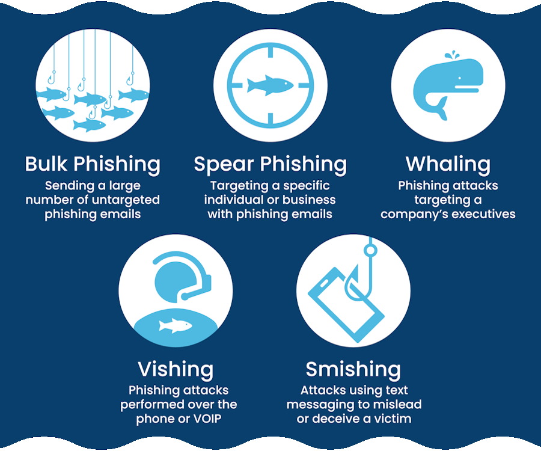

# Phishing Awareness



## Understanding Phishing

### What is Phishing?

Phishing is a type of cyber attack where malicious actors impersonate legitimate organizations to trick individuals into providing sensitive information such as usernames, passwords, or financial details. Phishing attacks can occur through emails, messages, or even phone calls.

### Why Is Phishing a Concern?

Phishing is one of the most common cybersecurity threats faced by organizations. According to recent statistics, many data breaches are caused by phishing attacks. Understanding how to recognize and respond to phishing attempts is crucial for protecting both personal and company data.

### Common Types of Phishing



- **Email Phishing:** The most widespread form, where attackers send fraudulent emails that appear to come from reputable sources.
- **Spear Phishing:** A targeted attack aimed at a specific individual or organization. These emails often contain personal information to make them more convincing.
- **Whaling:** A specialized form of spear phishing that targets high-profile individuals such as executives.
- **SMS Phishing (Smishing):** Attackers use text messages to lure victims into providing personal information.
- **Voice Phishing (Vishing):** Cybercriminals use phone calls to trick individuals into revealing confidential information.

---

## Key Characteristics of Phishing Emails

- **Urgent Language:** Phishing emails often create a sense of urgency (e.g., "Your account will be suspended unless you act now!").
- **Generic Greetings:** Many phishing emails use generic salutations like "Dear Customer" instead of your name.
- **Suspicious Links or Attachments:** Hover over links to see the actual URL. Legitimate emails will not have unusual or misspelled URLs.
- **Poor Grammar and Spelling:** Many phishing emails contain noticeable errors or awkward phrasing.

---

## Recent Phishing Strategies

- **Impersonation of Trusted Brands:** Attackers frequently impersonate well-known companies or services, including tech giants, banks, and government agencies.
- **Use of Spoofed Email Addresses:** Cybercriminals often alter the sender's address slightly to mimic a legitimate email address (e.g., using "examp1e.com" instead of "example.com").
- **Malware Delivery:** Some phishing emails may include attachments that, when opened, install malware on your device.
- **Cloud Storage Links:** Attackers may share malicious documents via services like Google Drive or Dropbox, making them seem more legitimate.

---

## Recognizing Phishing Emails

Phishing emails often attempt to disguise themselves as being from a legitimate source like a government agency, business, or person seeking help. Common red flags include:

- Urgent language that asks you to act immediately.
- Misspellings and altered images.
- Offers that seem too good to be true.

---

## Phishing Email Examples

### Example 1: Phishing Email Impersonating Social Security

```
 From: alerts@SocialSecurityAgency.com 
 To: [Employee's Email Address] 
 Subject: Important: Action Required for Your Social Security Account
 
  Dear Valued Customer,
 
  We have detected unusual activity in your Social Security account. 
   
  To ensure your security, we require your immediate attention.
   
  Please verify your account information by clicking the link below:
 
  [Verify My Account]
 
  Failure to comply may result in temporary suspension of your benefits.
   
  Thank you for your prompt attention to this matter.
 
  Sincerely, Social Security Agency Customer Support Team
```

In this example you can see that the address is “SocialSecurityAgency.com” not “SSA.gov”. The second clue is the urgency, words like “Action required”, and then asking the user to click a specific link. 

- **Clue 1:** The address is “SocialSecurityAgency.com” instead of “SSA.gov.”
- **Clue 2:** The use of urgency with phrases like “Action required” and a prompt to click a specific link.

---

### Example 2: Phishing Email Impersonating IT Support

```
 From: IT Support it-support@company-internal.com
 To: [Employee's Email Address]
 Subject: Urgent: Immediate Action Required for Account Security
 
  Dear [Employee's Name],
 
  We are currently conducting a routine security audit of all employee accounts. During this process, we have identified unusual activity associated with your account that requires immediate verification.
 
  To protect your sensitive information and prevent unauthorized access, please log in to the company portal using the link below and confirm your account details:
 
  [Verify My Account]
 
  This action is mandatory. Failure to verify your account within the next 24 hours will result in a temporary suspension of your access to company systems.
 
  If you have any questions or concerns, please do not hesitate to reach out directly.
  Thank you for your cooperation.
 
  Best regards,  
  IT Security Team  
  Innovatech Solutions
```

In this example, the sending address does not appear to be legitimate, there is an immediate call to action, and a threat to create anxiety in the employee. Anything that appears questionable should be verified with the IT Department by forwarding the email to "Phishing@Innovatech.com."

- **Clue 1:** The sender's address does not seem legitimate.
- **Clue 2:** The email creates a sense of urgency by demanding immediate action.
- **Clue 3:** Threatening language is used to induce anxiety and compliance.

---

### Example 3: Phishing Email Impersonating a Rewards Program

```
 From: Global Rewards Program info@globalrewards.com
 To: [Employee's Email Address]
 Subject: Congratulations! You've Won a $1,000 Gift Card!
 
  Dear [Employee's Name],
 
  We are excited to inform you that you have been selected as one of our lucky winners in the Global Rewards Program! As a token of our appreciation, you have won a $1,000 gift card that can be used at a wide range of popular retailers.
 
  To claim your gift card, please follow these simple steps:
 
  - Click the link below to verify your identity.
  - Fill out the brief form with your details.
  - Enjoy your reward!
 
  [Claim Your $1,000 Gift Card Now!]
 
  This exclusive offer is available for a limited time, so don’t miss out!
 
  Thank you for being a valued member of our community. We look forward to rewarding you!
 
  Best regards,  
  Emily Carter  
  Customer Relations  
  Global Rewards Program
```

In this example, the first clue is the offer that seems too good to be true, followed by a sense of urgency and a likely fictitious company.

- **Clue 1:** The offer seems too good to be true.
- **Clue 2:** There is urgency to act quickly.
- **Clue 3:** The sender is likely from a non-existent company.

---

## How to Protect Yourself from Phishing

- **Be Skeptical:** Always question unexpected emails or messages, especially those that request personal information.
- **Verify:** If an email seems suspicious, contact the organization directly using official contact methods.
- **Do Not Click:** Avoid clicking on links or downloading attachments from unknown sources.
- **Use Security Software:** Ensure that you have up-to-date antivirus software installed.
- **Report Suspicious Emails:** Forward any suspicious emails to Phishing@Innovatech.com.

---

## Conclusion

Phishing remains a significant threat in today's digital landscape. By understanding the tactics used by cybercriminals and applying the protective measures outlined above, you can help safeguard your personal information and the integrity of Innovatech Solutions.