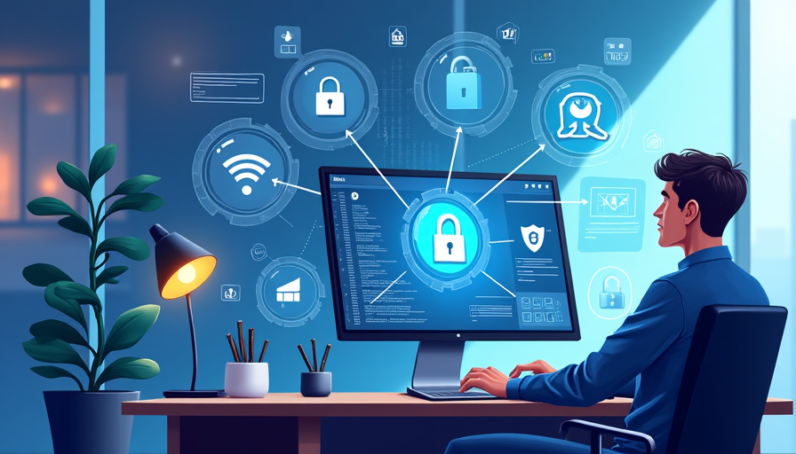

# Protecting Networks and Databases: Essential Measures for Cybersecurity

At Innovatech Solutions, safeguarding our networks and databases is a top priority. Protecting sensitive data requires a combination of tools and best practices to defend against growing cyber threats. Implementing firewalls, encrypting data, and securing Wi-Fi networks with password authentication are crucial steps in building a robust defense system.

## Firewalls

Firewalls act as the first line of defense by monitoring and controlling incoming and outgoing traffic based on security rules. These rules determine whether certain data packets—small units of communication over a network—are allowed to pass through the firewall or if they should be blocked. Firewalls can be hardware-based, software-based, or a combination of both. 

Firewalls help block unauthorized access, protecting the network from threats such as hackers, malware, and other malicious attacks. They also control outbound traffic to prevent compromised systems within the network from communicating with external attackers, limiting the spread of potential damage. In modern cybersecurity, firewalls play a crucial role in securing networks by providing a gatekeeper function that helps keep sensitive data safe and networks secure from external threats.

## Encryption

Encryption is a critical security measure that ensures sensitive data remains secure, whether it is stored on a system (data at rest) or transmitted across networks (data in transit). Encryption works by converting plain text or readable data into an unreadable format known as ciphertext, using a specific algorithm and an encryption key. This ensures that even if an unauthorized party, such as an attacker, intercepts or gains access to the data, it will be virtually impossible to interpret or use without the corresponding decryption key.

In practice, encryption helps secure a wide variety of data, including:
- **Financial Information:** such as credit card details or bank transactions.
- **Personally Identifiable Information (PII):** like social security numbers or medical records.
- **Communications:** messages, emails, or voice communications.

### Types of Encryption

1. **Symmetric Encryption:** In this method, the same key is used for both encryption and decryption. While it is fast and efficient for large amounts of data, the challenge lies in securely sharing the encryption key between parties. Popular algorithms include AES (Advanced Encryption Standard) and DES (Data Encryption Standard).
   
2. **Asymmetric Encryption:** This approach uses two different keys—a public key for encryption and a private key for decryption. This is more secure for key sharing because the public key can be distributed openly, while the private key remains confidential. However, asymmetric encryption is slower and is often used in conjunction with symmetric encryption for secure key exchange. RSA (Rivest-Shamir-Adleman) is a widely used algorithm in this category.

Encryption plays a key role in preserving data integrity and authenticity. For example, encrypted data can be paired with digital signatures to confirm that the data hasn’t been tampered with and that it originates from a legitimate source.

## Securing Wi-Fi Networks

Lastly, securing Wi-Fi networks with strong passwords is essential for maintaining the integrity of an organization’s or individual’s cybersecurity. A weak or unsecured Wi-Fi network presents an easy target for cybercriminals, as it allows them to bypass the first layer of protection and gain direct access to internal systems. 

### Key Reasons for Securing Wi-Fi Networks

1. **Preventing Unauthorized Access:** A strong, complex password ensures that only authorized users can connect to the network.
2. **Protecting Data in Transit:** An unsecured Wi-Fi network can expose data transmitted between devices to interception through techniques like "packet sniffing."
3. **Blocking Man-in-the-Middle Attacks:** Strong network security helps prevent unauthorized access.
4. **Preventing Malware Infections:** Once inside an unsecured Wi-Fi network, attackers can exploit vulnerabilities in connected devices.
5. **Limiting the Spread of Attacks:** A well-protected network acts as a barrier that reduces the attack surface available to hackers.

### Recommendations for Wi-Fi Security

- Use strong, unique passwords that include a mix of characters, numbers, and symbols.
- Enable WPA3 encryption (the latest Wi-Fi security standard) or at least WPA2.
- Change default router passwords and SSID names.
- Regularly update router firmware to patch security vulnerabilities.
- Implement network segmentation to isolate critical systems from less secure devices.

## Conclusion

In summary, securing Wi-Fi networks with strong passwords is a vital step in defending against cyber threats. A well-protected network not only safeguards data but also prevents attackers from exploiting the wireless connection to infiltrate internal systems, preserving the overall security and privacy of the organization or household.

In addition to these technical safeguards, employees must remain vigilant against common phishing threats, including fraudulent emails and texts. Always double-check suspicious communications, and never click on links or share personal information unless verified. At Innovatech Solutions, our commitment to cybersecurity awareness ensures that our network and data remain secure from evolving cyber threats.
