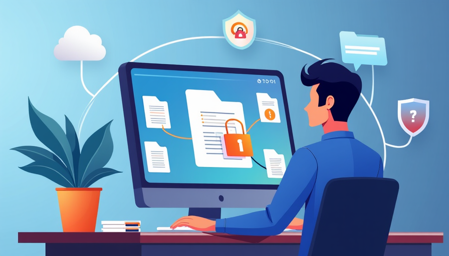

# Data Protection

## Data Protection Best Practices

### What is Data Protection?

Data protection involves safeguarding sensitive information from unauthorized access, loss, or corruption. It encompasses practices, policies, and technologies designed to protect both personal and organizational data.

### Why Is Data Protection Important?

At Innovatech Solutions, protecting data is crucial for maintaining client trust, compliance with legal regulations, and preventing financial losses. Data breaches can lead to severe repercussions, including legal penalties and reputational damage.

---

## Types of Data to Protect

- **Personally Identifiable Information (PII):** Names, addresses, Social Security numbers, and any other information that can identify individuals.
- **Financial Data:** Credit card information, bank account details, and payment records.
- **Corporate Data:** Intellectual property, trade secrets, and confidential business strategies.
- **Customer Data:** Information related to customers, including contact details and purchase history.

---

## Best Practices for Data Protection

- **Classify Data:** Understand the sensitivity of the data you handle. Use classification labels such as "Confidential," "Internal," and "Public" to categorize information.
- **Limit Access:** Implement the principle of least privilege—grant access only to those who need it to perform their job functions.
- **Encrypt Sensitive Data:** Use encryption to protect data both at rest and in transit. This makes data unreadable if intercepted by a third party.
- **Backup Regularly:** Regularly back up important data and store it securely. Test backups periodically to ensure data can be restored.
- **Secure Disposal of Data:** When data is no longer needed, ensure it is securely deleted. Use methods such as shredding documents or wiping drives.

---

## Recognizing Data Breaches

Be vigilant for signs of a data breach, including:
- Unusual account activity or unauthorized access attempts.
- Notifications from IT about compromised accounts or systems.
- Unsolicited requests for sensitive information from unknown sources.

---

## Handling Sensitive Data

- **Use Secure Channels:** Always use secure methods (like encrypted email or secure file transfer protocols) when sharing sensitive information.
  
---

## What You Can Do

- Never access sensitive data or company accounts over unsecured public networks. Use a VPN for secure connections. Company employees required to access data offsite should use the company’s VPN service.
- Always verify the identity of the sender before providing any sensitive information, even if the request appears to come from a trusted source.
- Familiarize yourself with Innovatech Solutions' data protection policies and procedures. Ensure that you understand your responsibilities regarding data security and protection.
- Always log off your terminal when not present.
- Shred any customer’s private information when no longer needed.
- Store all customer’s private information in locked storage.
- Avoid oversharing personal information on social media.
- Report any suspicious activity. Examples include someone leaning over your shoulder when you are typing, someone attempting to access a restricted area, someone asking suspicious questions, or noticing phishing or vishing attempts.

---

## Conclusion

Protecting data is a shared responsibility at Innovatech Solutions. By following the best practices outlined in this module, you can help safeguard our sensitive information and maintain the trust of our clients and partners.
