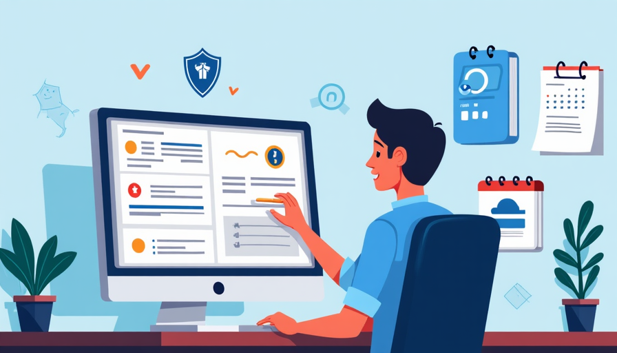

# Software Installation and Update

## Installing and Updating Software Safely

### What is Software Installation and Updating?

Software installation refers to the process of adding new applications or programs to a computer or device. Updating software involves downloading and installing the latest versions or patches to improve functionality, fix bugs, or address security vulnerabilities.

### Why Are Software Installation and Updates Important?

Keeping software up to date is critical for maintaining security and performance. Threat actors often exploit vulnerabilities in outdated software to gain unauthorized access to systems and data. Regular updates can protect Innovatech Solutions from potential threats.

---

## Best Practices for Installing Software

- **Download from Official Sources:** Always download software from the official website or trusted sources. Avoid third-party sites that may host malicious versions of software.
- **Only download from HTTPS sites:** HTTPS is secure; HTTP is not.
- **Read User Reviews:** Look for feedback and ratings from other users to assess the reliability and safety of the software.
- **Understand Permissions:** Review the permissions that the software requests during installation. Be cautious if it asks for more access than necessary.
- **Use Antivirus Software:** Ensure your antivirus software is enabled and up to date before downloading and installing new applications.

---

## Best Practices for Updating Software

- **Enable Automatic Updates:** Whenever possible, enable automatic updates to ensure that software stays current without requiring manual intervention.
- **Regularly Check for Updates:** For software that does not support automatic updates, make it a habit to check for updates weekly or monthly.
- **Apply Security Patches Promptly:** When critical updates are released, apply them as soon as possible to protect against vulnerabilities.
- **Backup Before Updating:** Create a backup and save any active data on your workstation before installing any updates or upgrades to prevent data loss in case of issues.
- **Stay Informed:** Follow vendor announcements and security bulletins to stay aware of known vulnerabilities and available patches.
- **Always restart your computer after updates when prompted to do so.**

---

## Recognizing Malicious Software

Be on the lookout for signs that may indicate the presence of malicious software (malware):

- Unexpected pop-up ads or alerts.
- Sluggish system performance or frequent crashes.
- Unfamiliar applications appearing on your device.
- Unusual network activity.

---

## What to Do If You Encounter Issues

- **Email Support@Innovatech.com:** If you experience problems during installation or updating, a member of the IT Support team will reach out to you for troubleshooting.
- **Document the Issue:** Take notes on any error messages or unusual behavior, which can help IT diagnose the problem.
- **Do Not Bypass Security Features:** If your system prompts you with security warnings during installation, do not ignore them.

---

## Conclusion

Properly installing and updating software is vital to maintaining the security and functionality of your devices at Innovatech Solutions. By following the best practices outlined in this module, you can help safeguard our systems from cyber threats.
