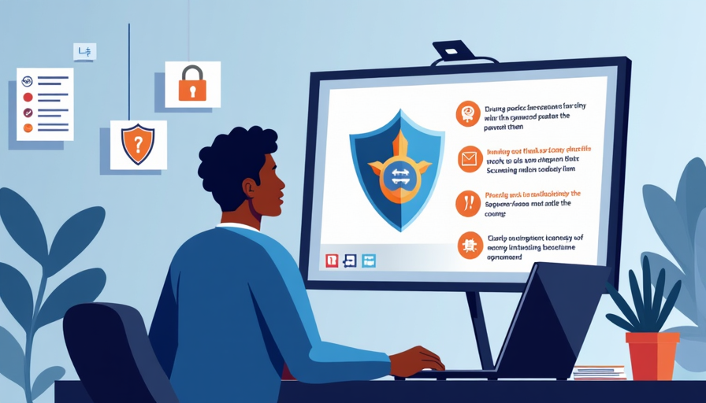

# Training Employees in Cybersecurity Best Practices

## Importance of Cybersecurity Training

### Why Train Employees in Cybersecurity?

At Innovatech Solutions, protecting sensitive information is a top priority, and effective training is essential for building a robust cybersecurity posture. Creating and enforcing security policies, such as strong password requirements, plays a crucial role in ensuring that employees adhere to best practices.

### Password Security

Passwords are often the first line of defense against unauthorized access, making it imperative that they are complex and unique. Innovatech Solutions emphasizes the importance of using passwords that contain a mix of letters, numbers, and special characters while also encouraging the use of password managers to store them securely.

---

## Key Areas of Cybersecurity Training

- **Phishing Awareness:** Ongoing training sessions are vital for educating employees about common phishing threats, including fraudulent emails and texts. These sessions should cover how to recognize suspicious communications and the appropriate steps to take when encountering potential scams.
- **Secure Software Usage:** Training should include best practices for software installation and updates, ensuring that all programs used are from trusted sources and regularly updated to avoid vulnerabilities.
- **Incident Response:** Employees should know the steps to take if they suspect a security breach, including who to report to and immediate actions to mitigate potential damage.

---

## Best Practices for Cybersecurity Training

- **Integrate into Onboarding:** By integrating cybersecurity training into the onboarding process, new employees learn the importance of cybersecurity from day one.
- **Regular Refreshers:** Conducting regular training sessions helps reinforce knowledge and keeps employees up-to-date on the latest threats and best practices.
- **Interactive Learning:** Use quizzes, simulations, and interactive content to engage employees and make learning more effective.

---

## Building a Cybersecurity Culture

- **Promote Vigilance:** Foster a culture where employees are vigilant about cybersecurity and understand their role in protecting the organization.
- **Provide Resources:** Ensure that employees have access to the necessary tools and resources, such as password managers and updated security policies, to support their efforts in maintaining cybersecurity.
- **Recognize Good Practices:** Acknowledge and reward employees who demonstrate good cybersecurity practices to encourage a proactive approach across the organization.

---

## Conclusion

By equipping employees with the knowledge and tools to protect themselves and the company, Innovatech Solutions fosters a culture of vigilance and responsibility. This proactive approach helps mitigate risks and ensures a safer digital environment for everyone at Innovatech Solutions.